# PayERupee Database Entity-Relationship (ER) Diagram

**Engine:** PostgreSQL (ACID Compliant)  
**ORM:** Prisma 7 with Driver Adapter (`@prisma/adapter-pg`)  
**Currency Precision:** `Decimal(18, 4)`  

---

## 1. Visual Entity-Relationship Diagram

```mermaid
erDiagram
    User ||--o| Wallet : "owns"
    User ||--o{ ApiKey : "generates"
    User ||--o{ Payout : "initiates"
    User ||--o{ FundRequest : "requests"
    User ||--o{ AuditLog : "triggers"
    User ||--o{ SupportTicket : "opens"
    User ||--o{ SupportMessage : "sends"
    User ||--o{ Blacklist : "created_by"
    
    Wallet ||--o{ WalletTransaction : "records"
    SupportTicket ||--o{ SupportMessage : "contains"

    User {
        string id PK
        string email UK
        string name
        string businessName
        string address
        string phone UK
        enum role "ADMIN | MERCHANT"
        enum status "PENDING | ACTIVE | SUSPENDED | DELETED"
        datetime kycApprovedAt
        datetime createdAt
        datetime updatedAt
        datetime deletedAt
    }

    Session {
        string id PK
        string token UK
        string userId FK
        datetime expiresAt
        string ipAddress
        string userAgent
    }

    Account {
        string id PK
        string userId FK
        string providerId
        string accountId
        string password
    }

    Verification {
        string id PK
        string identifier
        string value
        datetime expiresAt
    }

    Wallet {
        string id PK
        string merchantId FK, UK
        enum currency "INR"
        decimal balance "Decimal(18,4)"
        int version "Optimistic Locking"
        boolean isActive
        datetime createdAt
        datetime updatedAt
    }

    WalletTransaction {
        string id PK
        string walletId FK
        enum type "CREDIT | DEBIT"
        enum category "FUND_ADD | PAYOUT | FEE | TAX | REFUND | ADJUSTMENT"
        decimal amount "Decimal(18,4)"
        decimal fee "Decimal(18,4)"
        decimal tax "Decimal(18,4)"
        decimal balanceAfter "Decimal(18,4)"
        enum referenceType "FUND_REQUEST | PAYOUT | SYSTEM"
        string referenceId
        string externalReference "UTR / Bank RRN"
        string description
        datetime createdAt "Immutable"
    }

    FundRequest {
        string id PK
        string merchantId FK
        string approvedById FK
        decimal amount "Decimal(18,4)"
        enum status "PENDING | APPROVED | REJECTED"
        enum paymentMode "UPI | IMPS | NEFT | RTGS"
        string utrNumber UK
        string receiptUrl
        string remarks
        string rejectionReason
        datetime processedAt
        datetime createdAt
        datetime updatedAt
    }

    Payout {
        string id PK
        string merchantId FK
        string idempotencyKey "Composite UK"
        string batchId
        decimal amount "Decimal(18,4)"
        decimal fee "Decimal(18,4)"
        decimal tax "Decimal(18,4)"
        decimal netAmount "Decimal(18,4)"
        enum status "PENDING | PROCESSING | SUCCESS | FAILED | REVERSED"
        enum paymentMode "IMPS | NEFT | RTGS | UPI | WALLET"
        enum provider "MANUAL | RAZORPAY | CASHFREE | PAYTM | BANK"
        string accountNumber
        string ifscCode
        string accountHolderName
        string beneficiaryPhone
        string merchantReference
        string bankReference UK
        string failureReason
        datetime processedAt
        datetime createdAt
        datetime updatedAt
    }

    ApiKey {
        string id PK
        string merchantId FK
        string createdById FK
        enum environment "TEST | LIVE"
        string name
        string keyPrefix
        string lastFour
        string keyHash UK
        boolean isActive
        datetime lastUsedAt
        datetime expiresAt
        datetime revokedAt
        datetime createdAt
    }

    Blacklist {
        string id PK
        string merchantId FK "Nullable (Null = Global Admin Ban)"
        enum type "UPI | BANK_ACCOUNT | IFSC"
        string value UK
        string reason
        string addedById FK
        datetime createdAt
    }

    SupportTicket {
        string id PK
        string merchantId FK
        string subject
        enum status "OPEN | IN_PROGRESS | RESOLVED"
        enum priority "LOW | NORMAL | HIGH | URGENT"
        datetime createdAt
        datetime updatedAt
    }

    SupportMessage {
        string id PK
        string ticketId FK
        string senderId FK
        boolean isAdmin
        string message
        datetime createdAt
    }

    SystemSetting {
        string id PK "GLOBAL_SETTINGS"
        decimal upiPayoutFee
        decimal impsPayoutFee
        decimal neftPayoutFee
        decimal taxPercentage "GST % (e.g. 18.00)"
        datetime updatedAt
        string updatedById FK
    }

    AuditLog {
        string id PK
        string adminId FK
        enum entityType "USER | PAYOUT | FUND_REQUEST | API_KEY | WALLET | SYSTEM"
        string entityId
        enum action "CREATE | UPDATE | DELETE | APPROVE | REJECT | SUSPEND | RESTORE | PROCESS"
        string ipAddress
        string userAgent
        json metadata
        datetime createdAt
    }
```

---

## 2. Table-by-Table Technical Specifications

### 1. `users` Table
The central identity entity representing Merchants and Admins. Extended from the Better Auth specification with fintech capabilities.
* **`id`**: Primary Key (`cuid`).
* **`role`**: `MERCHANT` (default) or `ADMIN`.
* **`status`**: `PENDING` (awaiting admin KYC approval), `ACTIVE`, `SUSPENDED`, or `DELETED`.
* **`deletedAt`**: Soft-delete timestamp indexed via `@@index([deletedAt])`.

### 2. `wallets` Table
The cached monetary balance of a merchant.
* **`balance`**: `Decimal(18, 4)` initialized to `0.0000`.
* **`version`**: Integer incremented on each transaction to guarantee **Optimistic Concurrency Control**.
* **Integrity Rule**: Never updated independently without an accompanying row in `wallet_transactions`.

### 3. `wallet_transactions` Table (Immutable Double-Entry Ledger)
* **Immutability:** No `updatedAt` field exists. Once inserted, rows can never be altered or deleted.
* **`balanceAfter`**: A mandatory snapshot of the wallet balance immediately following the credit/debit.
* **`fee` & `tax`**: Explicitly itemized columns ensuring transparent bookkeeping.

### 4. `payouts` Table
Outbound disbursal records.
* **`idempotencyKey`**: Mandatory for API payouts. Protected by `@@unique([merchantId, idempotencyKey])`.
* **`status`**: Enforces the fintech state machine: `PENDING` ➔ `PROCESSING` ➔ `SUCCESS` / `FAILED`.
* **`bankReference`**: Unique UTR/RRN returned by the banking network upon disbursal success.

### 5. `fund_requests` Table
Merchant balance top-ups.
* **`utrNumber`**: Unique bank reference provided by the merchant, cross-referenced and approved by Super Admin.

### 6. `blacklists` Table
Fraud prevention table.
* If `merchantId` is `null`, it acts as a **Global Platform Ban** enforced across all merchants.
* If `merchantId` is set, it blocks payouts only for that specific merchant's account.

### 7. `support_tickets` & `support_messages`
Integrated customer support and issue resolution system connecting merchants directly to administrators.

### 8. `system_settings` Table
Singleton configuration row (`id = "GLOBAL_SETTINGS"`) storing dynamic platform tax rates (e.g., 18% GST) and per-mode payout processing fees.

### 9. `audit_logs` Table
Comprehensive compliance and security log capturing administrative actions (KYC approvals, fund releases, merchant suspensions).
